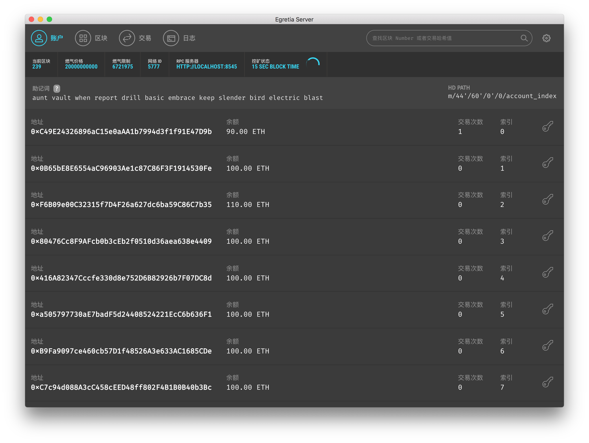

# 账户

当您启动 Egretia Server 时，屏幕将显示关于服务器的一些详细信息，并列出一些帐户。**每个账户都有100个 ETH**。在所有账户中自动生成 ether 允许您专注于开发应用程序。

账户主要包含如下几个功能：助记词、地址、余额、交易次数、私钥。

对于刚入门区块链的新手在使用钱包时往往会感到非常困惑，有几个名词必须深刻理解，这几个名词为：钱包、私钥、公钥、地址、密码、助记词、Keystore。

    若以银行账户相对比，这 5 个词分别对应内容如下：

    地址 = 银行卡号

    密码 = 银行卡密码

    私钥 = 银行卡号 + 银行卡密码

    助记词 = 银行卡号 + 银行卡密码

    Keystore + 密码 = 银行卡号 + 银行卡密码

    Keystore ≠ 银行卡号

## 助记词

助记词它是私钥的另一种表现形式，助记词 = 银行卡号 + 银行卡密码。助记词 = 私钥。主要目的是让用户更好的记住自己的私钥, 创建钱包后，会出现一个备份助记词功能，选择备份助记词，输入密码，会出现 12 个单词，每个单词之间有一个空格，这个就是助记词，一个钱包只有一个助记词且不能修改。

**用途：**助记词具有和私钥同样的功能，在导入钱包时，输入助记词并重新设置一个密码，就能进入钱包并拥有这个钱包的掌控权，并可以把钱包中的代币转移走。如果一旦泄露了你的助记词，那就等于裸奔。

**温馨提示：**助记词只能备份一次，备份后，在钱包中再也不会显示，因此在备份时最好抄写在笔记本里保存下来。

## 地址

公钥跟私钥是成对的，公钥由私钥计算而来，地址则通过公钥进一步计算而来。但注意一点：地址不是公钥。如图所示地址为以 0x 开头的 42 位 16 进制哈希值字符串，

    如：0x7A51Be24D95bb4935dd36eC836CFeDD77aa7b3C5。

这串字符就是钱包地址，钱包地址是唯一且不可修改的。也就是说一个钱包中所有代币的转账收款地址都是一样的。例如，一个钱包中 ETH 的转账收款地址和 EOS 的转账收款地址是一样。这一点和交易平台上的不一样，平台上不同代币的转账收款地址一般都不同，因此，转币到交易平台前一定要确认好地址。

**用途：**钱包地址可以用于接收别人转币，也可以作为转币的凭证。地址可以随便公开，而私钥则万万不能公开！

## 私钥

私钥本质上是一个长度固定的随机数，创建钱包后，输入密码可以就导出私钥，一个钱包只有一个私钥且不能改，谁拥有私钥，谁就有数字货币的控制权。所以私钥是非常关键的，一定要好好保存。但是由于私钥太长，钱包不会让用户自己设置，而是钱包自己来生成私钥。

**用途：**在导入钱包中，输入私钥并设置一个密码（不用输入原密码），就可以进入钱包并拥有这个钱包的使用权，就可以将钱包中的代币转移走。

## 其它

* **余额**就是当前地址中的余额，可以在这里随时查看自己的余额。
* **交易次数**就是当前地址进行的交易次数。

