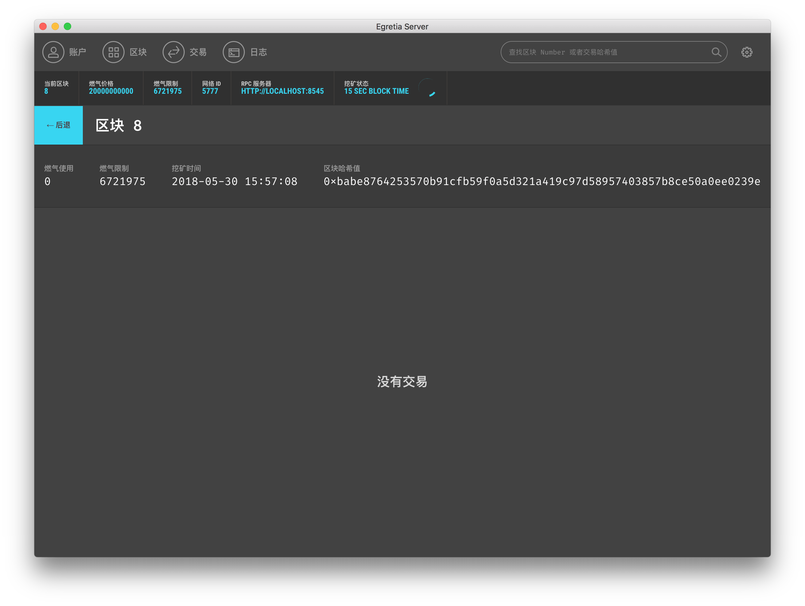
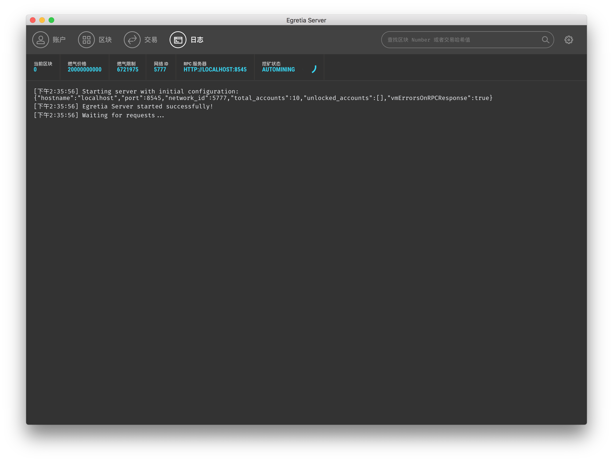

# 区块、交易、日志

其它三个页面逻辑相对简单一些，主要是方便 Dapp 开发过程中的数据查询。

## 区块

首先是区块，随着以太坊交易的不断增加，区块的个数也是不断地增长，当开发者需要查看区块内详细信息的时候，开发者只需要点击相应的区块数据即可，比如**区块 8**。

因为**区块 8** 内没有间隙，所以没有交易信息，但是会包含一些基本信息，比如燃气（Gas）使用了多少，Gas Limit 是多少，区块生成时间（挖矿时间）是什么时候都可以方便的、可视化的方式查看到。

## 交易

交易其实就是当两个账户之间产生转账交易的时候就会产生，这时候就可以通过交易页面查看到。

## 日志

Egretia Server 启动后，日志就会不停的记录下重要的日志信息，当开发的 Dapp 发生错误需要调试的时候，日志的功能可以节省大量的时间。

