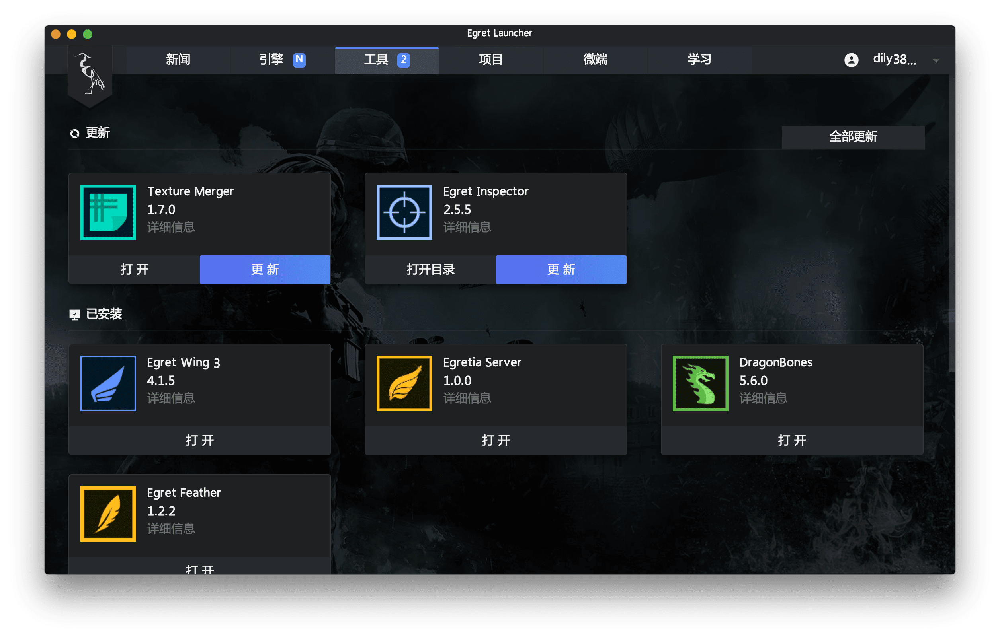
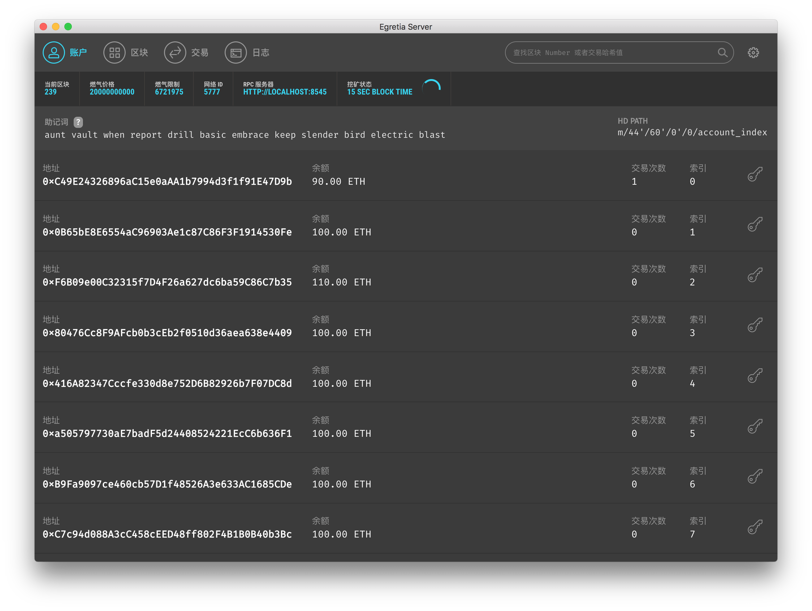

# Egretia Server 简介

Egretia Server 是区块链本地节点服务器，您可以使用它来部署智能合约，开发应用程序并运行测试。

## **适用平台**

* Windows
* Mac

## 安装

点击下方链接跳转到官方网站下载最新版 Egretia Server。

[Egretia 产品官网](http://egretia.io/product)

当然建议您使用 Egret Launcher 下载最新版 Egretia Server。

## 界面简介

当您启动 Egretia Server 时，屏幕将显示关于服务器的一些详细信息，并列出一些帐户。**每个账户都有100个 ETH**。在所有账户中自动生成 ether 允许您专注于开发应用程序。

**注意**：第一次启动 Egretia Server 时，系统会询问您是否要允许 Google Analytics（分析）跟踪。虽然可选，但开启此功能将有助于开发团队更好地了解 Egretia Server 是​​如何使用的。此跟踪完全匿名，并且不会收集任何帐户数据或私钥。

主要包含以下四个页面：

* **帐户**：页面显示账户及其余额。
* **区块**：页面显示所开采的区块，与所使用的 Gas 和交易信息。
* **交易**：页面列出对区块链运行的所有交易。
* **日志**：页面显示了 Egretia Server 详细日志，这对于调试有非常大的帮助。

另请注意，您可以从顶部的搜索框中搜索块号或交易哈希值。