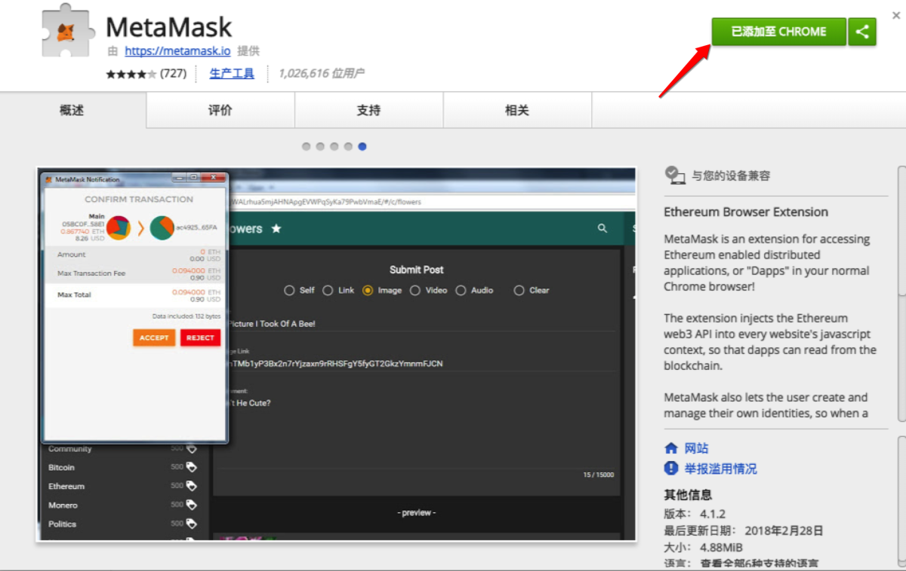
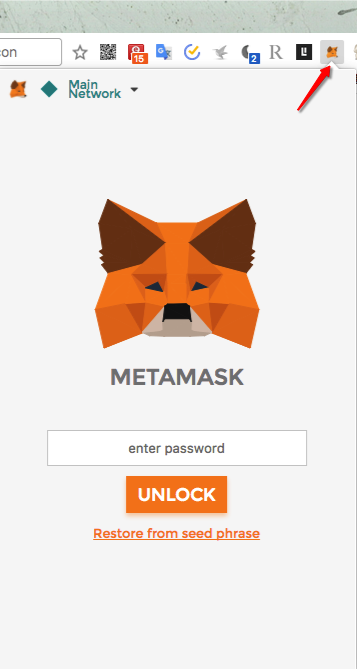
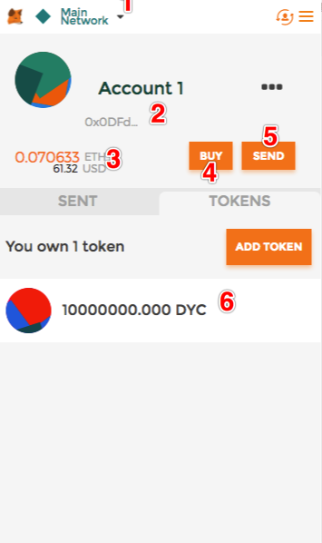
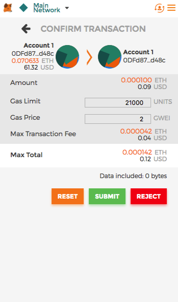

# Metamask 使用

MetaMask 是一款 Chrome 的以太坊轻钱包插件，只需要在 Chrome 商店下载安装即可（梯子自备）。

## MetaMask 安装

首先是安装 MetaMask，[Chrome 安装地址](https://chrome.google.com/webstore/detail/metamask/nkbihfbeogaeaoehlefnkodbefgpgknn?utm_source=chrome-ntp-icon)
你会看到下图，按照箭头所示点击「添加至 CHROME」即可

然后你的 Chrome 上即可看到已经安装完毕的 MetaMask

按照提示点击「Accept」即可，输入你的钱包密码，输入完毕后点击「CREATE」将显示的 12 个助记词记下来。

## MetaMask 使用方法

接下来我们看一下 MetaMask 的主要功能

* 可以选择 MetaMask 的区块链网络，默认的「MainNetwork」就是正式网络，下一篇文章练习 ICO 的需要用到测试网络
* 是你的以太坊地址
* 是你的以太坊余额
* 可以购买 ETH，但是咱们一般不用这个，使用国内的主流交易所即可，将 ETH 达到「2」地址即可
* 将 ETH 转给其它人，但是一般也是使用 MyToken 之类的 APP

如果你要使用 MetaMask 转 ETH 给其它地址的话就点击「Send」，会显示上述界面。填入地址和个数，点击「NEXT」。

点击「SUBMIT」即可