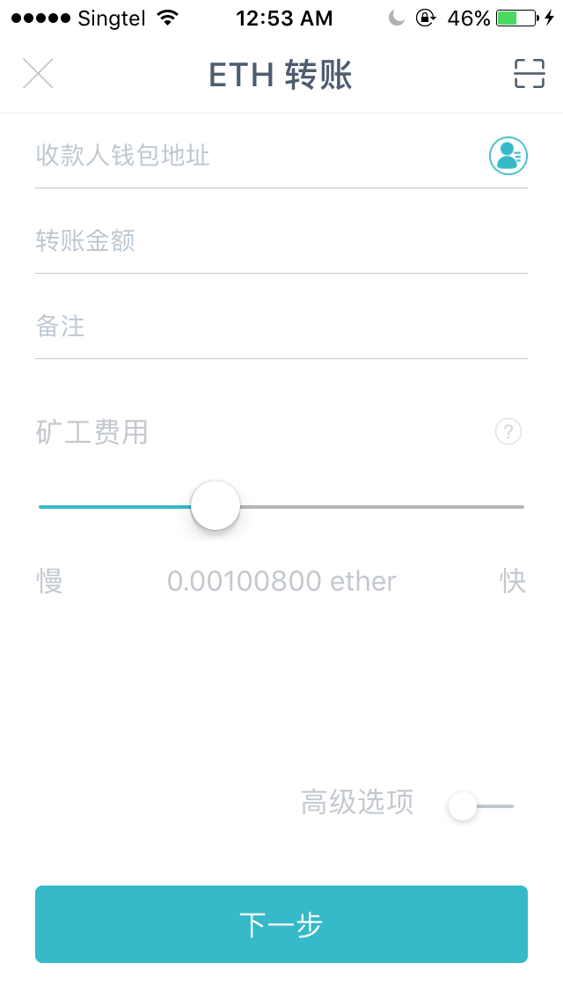
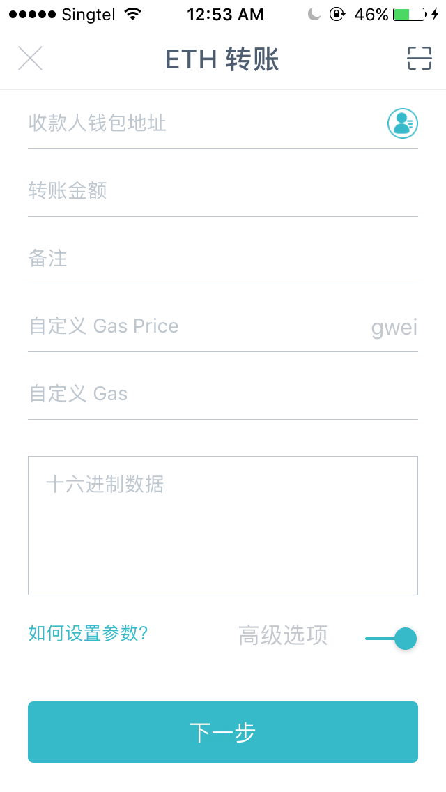

# 概览

Egretia Server 最主要的就是最顶部的概览，它包含了几个非常重要的信息：当前区块、燃气价格（Gas Price）、燃气限制（Gas Limit）、RPC 服务器、挖矿状态。

## 当前区块

如图所示，当前区块是 239，顾名思义，当前区块就是区块链当前的总共区块个数，知道当前区块数就可以方便的查询交易所在的区块位置。

## 燃气价格（Gas Price）、燃气限制（Gas Limit）

我们在以太坊转账交易的时候，不少钱包都会跳出这些设置如燃气价格（Gas Price）、燃气限制（Gas Limit）的选项让你选择，或者有的只让你选择矿工费（Fee）。

上图所示只需要输入矿工费。

上图所示选择高级选项：需要燃气价格（Gas Price）、燃气限制（Gas Limit）。

### 燃气价格（Gas Price）

交易发起者愿意为这次智能合约运行支付的 燃气（Gas） 的单位价格。 价格会根据市场供需关系浮动，不是固定值。

### 燃气限制（Gas Limit）

运行一个合约允许的最大消耗的燃气（Gas）的量。 这个值是预防程序出现死循环代码时，如果消耗的燃气（Gas）达到燃气限制（Gas Limit）程序会被强制终止，死循环会被终结。

### Gas Used By Txn

交易实际消耗掉的燃气（Gas）的量，对于一个已经发布的智能合约的某个固定功能而言其实是一个定量。 每个智能合约会实际消耗的燃气（Gas）是不同的，因为代码逻辑有差别。

### Tx Fee

交易手续费/矿工费，用 ETH 支付。 

    总价 = 消耗的 Gas 的量 * 单位 Gas 的价格

**注意**

* Gas Limit 控制了矿工最多可以消耗的 Gas，如果你转账设置的 Gas Limit 小于实际需要的 Gas，那么你的合约运行就会失败，费用被收走。
* 如果你的 Gas Limit 远大于实际需要的 Gas，那么计算费用的时候使用实际需要的 Gas 算的，多出来的 Gas 会退还给你。

### RPC 服务器

以太坊通过 RPC 服务来实现以太坊相关接口的远程调用，而如图所示，当前的 RPC 服务器地址为：

    HTTP://127.0.0.1:8545

通过地址，可以使用 Egretia Web Wallet 连接调试，当然也可以使用 Metamask 等第三方钱包连接调试。具体如何使用请参考 **Metamask 联调**。

### 挖矿状态

挖矿状态是 Egretia Server 特有的一个功能，而不是以太坊的功能，这个功能的作用是为了模拟以太坊挖矿的真实环境而产生的。他有两种状态，自动挖矿和按照时间间隔挖矿，自动挖矿瞬间完成，按照时间间隔挖矿，尽量模仿线上运行环境，方便调试 Dapp。