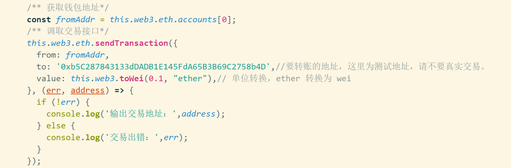

# Hello World

## Launcher 创建游戏

默认开发者已经安装了 Egretlauncher 工具，打开 Egretlauncher，点击项目 > 创建项目，勾选 Egretia SDK 模块，创建项目后，Egretia SDK 库会自动添加到游戏项目中，如图： 

## Wing 编写 Dapp 代码
  
* Egret SDK 中的命令空间为 `Web3`，然后您需要创建一个 `web3` 的实例，设置一个 provider。为了保证您不会覆盖一个已有的 provider，例如使用 MetaMask 或 EgretiaWallet 时有内置，需要先检查是否存在 `web3` 实例。

> 获取实例化后，您可以使用 `web3` 的相关[API](https://)

* Egretia SDK API 的使用，这里演示转账功能，如图：

## SmartIDE 编写智能合约
  
在线智能合约编辑器[地址](http://smartide.egretia.io/)，`add()` 方法用来返回输入两个数据的和，并会对 `add()` 方法的调用次数进行计数。需要注意的是这个计数是存在区块链上的，对它的调用需要使用 `transaction`。`getCount()` 返回 `add()` 函数的调用次数。由于这个函数不会修改区块链的任何状态，对它的调用使用 call 就可以了。

  
## 使用 Egretia Server 调试 Dapp
  
开发过程中我们直接使用链上的测试网络会很慢，也会带来其他的麻烦，我们可以使用 `Egretia Server` 进行本地调试。(下载地址)[]，按照提示安装即可。RPC 服务器地址为钱包连接的地址，连接后点击复制助记词，在钱包中生成地址进行登录钱包。

## Web Wallet 钱包调试 Dapp

Web Wallet 是 Egretia 团队提供给开发者的网页端钱包。区块链游戏开发和传统游戏开发另一个非常大的区别在于，区块链游戏需要经常和区块链进行交互，所以会频繁的和钱包打交道。虽然市面上有 Metamask 等第三方钱包，但是对于区块链游戏开发不是非常方便，所以 Egretia 团队开发了本地调试钱包 Web Wallet。在区块链游戏的开发过程中，Web Wallet 是嵌入到游戏中的，这样调试游戏的时候就可以方便的使用。

只需要在 index.html 中添加下面一句话即可使用：

      

如下图所示：

成功引入后运行界面：

  

## 发布 Dapp

打开 Egretlauncher 点击发布设置。

弹出发布选项，选择 Blockchin Game，点击发布，会发布到 `bin-release` 目录下

> 如果不需要钱包需要在 index.html 中将钱包引入代码注释掉。