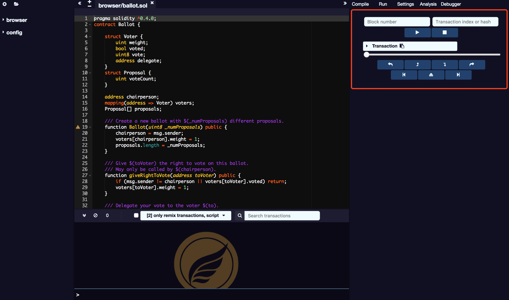
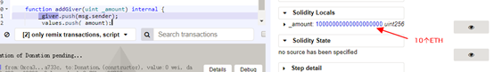
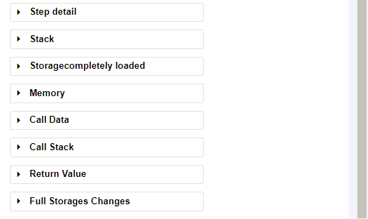
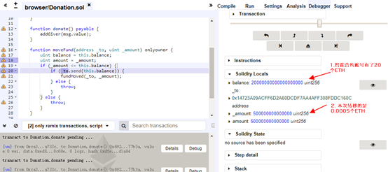
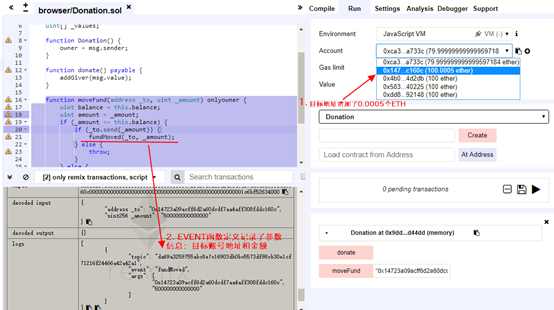

# 调试

该模块允许您调试交易。它可以用来部署从 SmartIDE 创建的交易。（只有当前环境提供必要的功能时，调试才有效）。

调试器允许查看交易合约执行的详细信息。它使用左侧的编辑器显示执行时源码的位置。

交易控制面板显示当前交易合约的基础信息。导航栏包括7个按钮用于交易的单步调试。

**调试器按钮**

从左到右的按钮名称:
* step over back
* step back
* step into
* step over forward
* jump to the previous breakpoint
* jump out
* jump to the next breakpoint

下面有11个面板用于显示执行的详细信息。

## Instructions 面板

Instructions 面板显示当前高亮显示的运行合约的汇编语言。

**注意：** 当该面板隐藏时，滑动条的运行粒度是一个 course 的，即使在多 EVM 环境构建，也只会在语法边界停止；当该面板显示时，才可能逐步进入到构建函数内部，即使对应相同的语句。

## Solidity Locals面板

Solidity Locals面板显示当前上下文环境的局部变量值。

## Solidity State面板

Solidity State面板显示的是当前执行合约的状态变量。

## Low level面板

以下面板显示本次执行的低层次信息：

* Stack 堆栈
* Storages Changes 存储改变
* Memory 内存
* Call Data 调用数据
* Call Stack 调用堆栈
* Return Value 返回值，只有当运行到RETURN原语才显示
* Full Storages Changes 全存储改变，只有在执行末尾才显示所有改变的合约变化存储

## 交易回滚(Reverted Transaction)

一个交易合约可以回滚，例如因为 GAS 超限，程序抛出 throw 语句或者低层次的异常。在这种场景下，识别异常和定位异常的代码位置是非常重要的。当执行抛出异常时，SmartIDE 将警告。warning 按钮将在异常发生前跳转到最后的执行原语。

需要说明的是，智能合约交易的执行是事件级别的，就是无法如 C++ 一样在运行中改变变量值，只能一次执行完毕。调试器记录了执行的原语记录，所以可以前进和回滚。对于回滚，就像影片回滚放映一样，非常酷炫。

## Breakpoints断点和单步调试

导航栏的 5,7 按钮按钮用于回滚到前一个断点和执行到下一个断点。

在左侧编辑框的行数处单击即可增加和删除断点。

作为样例，在 18 行和 20 行双击，设置 2 个断点，在 Run 面板的 moveFund 输入框内输入参数,给第二个账号转移 0.0005 个ETH。点击”MoveFund”执行该交易函数。

"0x14723a09acff6d2a60dcdf7aa4aff308fddc160c",500000000000000

合约交易执行成功后，点击终端输出器中的 Debug 按钮，点击调试面板的“Jump to the next breakpoint”程序会运行到第一个断点处。

再点击“Jump to the next breakpoint”按钮一次，直接运行到 20 行第二个断点处。

点击”Jump out”函数跳出该函数，运行完成后可以看到第二个账号余额发生了改变，增加了 0.0005 个ETH。

点击展开 Detail，可以看到EVENT事件记录的参数信息。

