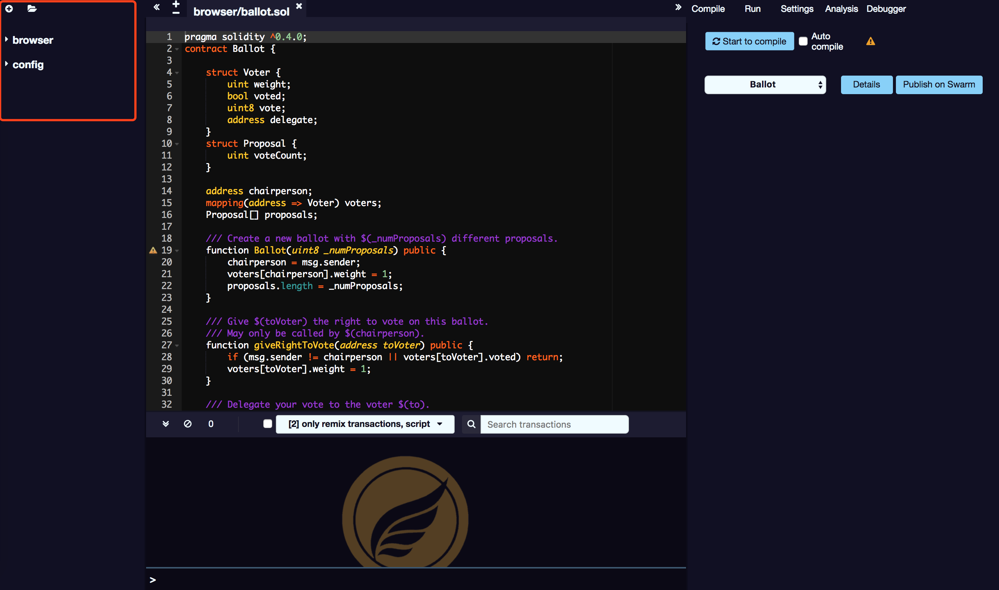

# 资源管理器

文件浏览器默认列出存储在浏览器中的所有文件。您可以在浏览器文件夹中看到它们。您可以随时重命名，删除或添加新文件到文件资源管理器。

请注意，清除浏览器存储将永久删除您编写的所有可靠文件。

我们将从左上角的图标开始 - 从左到右：

## 创建新文件

untitled.sol在Remix中创建一个新文件。

## 添加本地文件

允许您从本地文件系统中选择文件并将其导入到Remix浏览器存储。