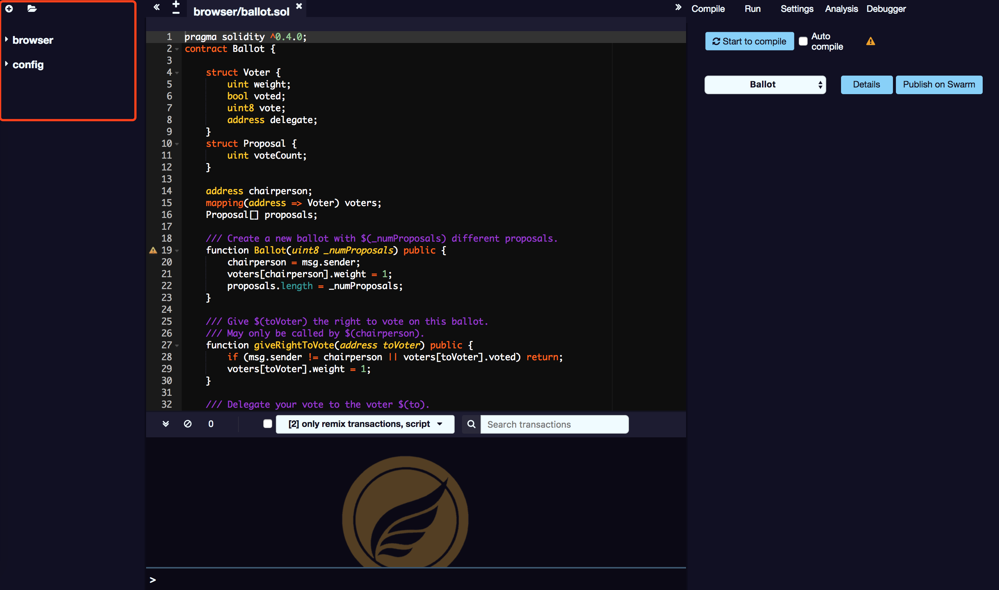

# SmartIDE 简介

开发区块链游戏避不开智能合约的开发，SmartIDE 是一款功能强大的开源工具，可以让您直接在云端编写 Solidity 合约。

## **适用平台**

云端：[SmartIDE](http://smartide.egretia.io/)

## 界面简介

SmartIDE 主要包含以下八大功能：

* **资源管理器**：文件浏览器默认列出存储在浏览器中的所有文件。您可以在浏览器文件夹中看到它们。您可以随时重命名，删除或添加新文件到文件资源管理器。
* **代码编辑器**：每次更改当前文件或选择其他文件时，SmartIDE 编辑器都会重新编译代码。它还提供了关键字的语法高亮显示。
* **控制台输出**：控制台可以查看 SmartIDE 输出的事件。
* **编译**：智能合约编写好之后需要使用编译功能，如果有错误会显示在合约下方。
* **运行 & 部署**：运行选项卡是 SmartIDE 的一个重要部分。它允许您将智能合约部署到区块链中。
* **设置**：设置显示当前的编译器版本，并允许更改为其他版本。
* **分析**：分析功能提供有关上次编译的信息。默认情况下，每个编译都会运行一个新的分析。
* **调试**：该模块允许您调试交易。它可以用来部署从 SmartIDE 创建的交易。（只有当前环境提供必要的功能时，调试才有效）。