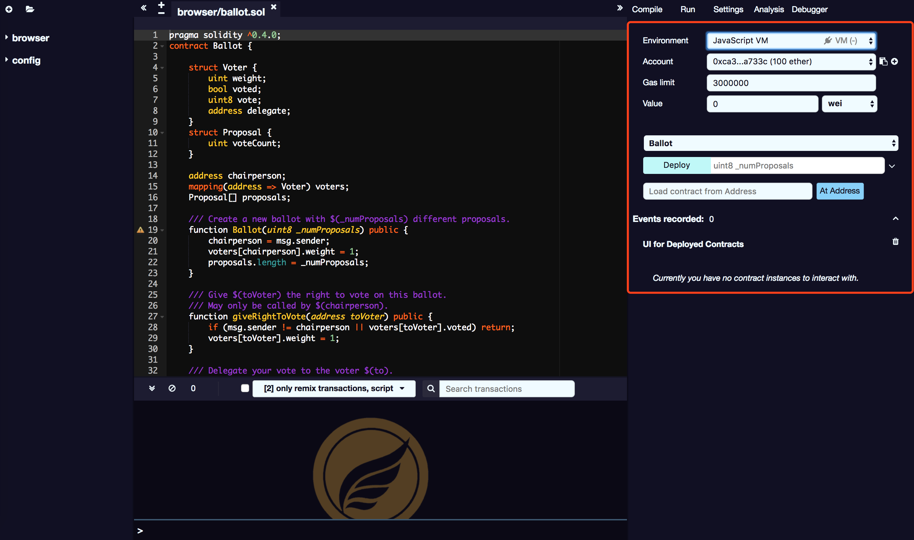

# 运行 & 部署

运行选项卡是 SmartIDE 的一个重要部分。它允许您将智能合约部署到区块链中。

## 环境

* **JavaScript VM：** 所有交易将在浏览器的沙箱区块链中执行。这意味着这只是一些临时数据，页面重新加载将会重新启动一个新的区块链，临时的数据也会被清空。
* **Injected Provider：** SmartIDE 将连接到提供 Web3 注入的钱包，比如 Metamask。
* **Web3 Provider：** SmartIDE 将连接到远程节点。您需要向选定的提供者提供 URL 地址，这个就可以连接 Egretia Server 的 RPC 地址。

## 帐户

与当前环境相关联的帐户列表（及相关余额）。

## Gas Limit（气体限制）

可以为在 SmartIDE 中创建的所有交易设置的最大气体量，如果超过会强制停止代码运行。

##  Gas 值

下一个创建的交易的值的 Gas 价格（在每次事务执行后，该值总是被重置为0）。

## 部署

本节包含已编译合同和两项操作的列表：

* **At Address：** 假定给定的地址是所选合约的一个实例。然后可以与已部署的合同进行交互。因为此时没有检查，因此使用此功能时请小心，并确保您信任该地址的合同。
* **Create：** 发送部署选定合同的交易。当交易被打包进区块中，新创建的实例将被添加（这可能需要几秒钟）。请注意，如果constructor 有参数，则需要指定它们。
* **待定实例：** 验证交易需要几秒钟。在此期间，GUI 将以挂起模式显示它。当交易被打包进区块中，未决交易的数量被更新并且交易被添加到日志。