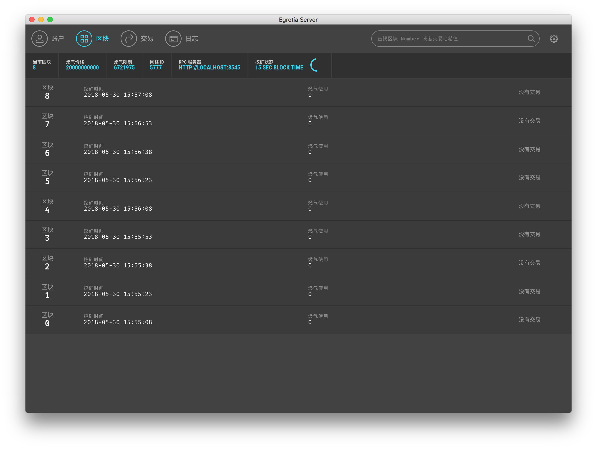
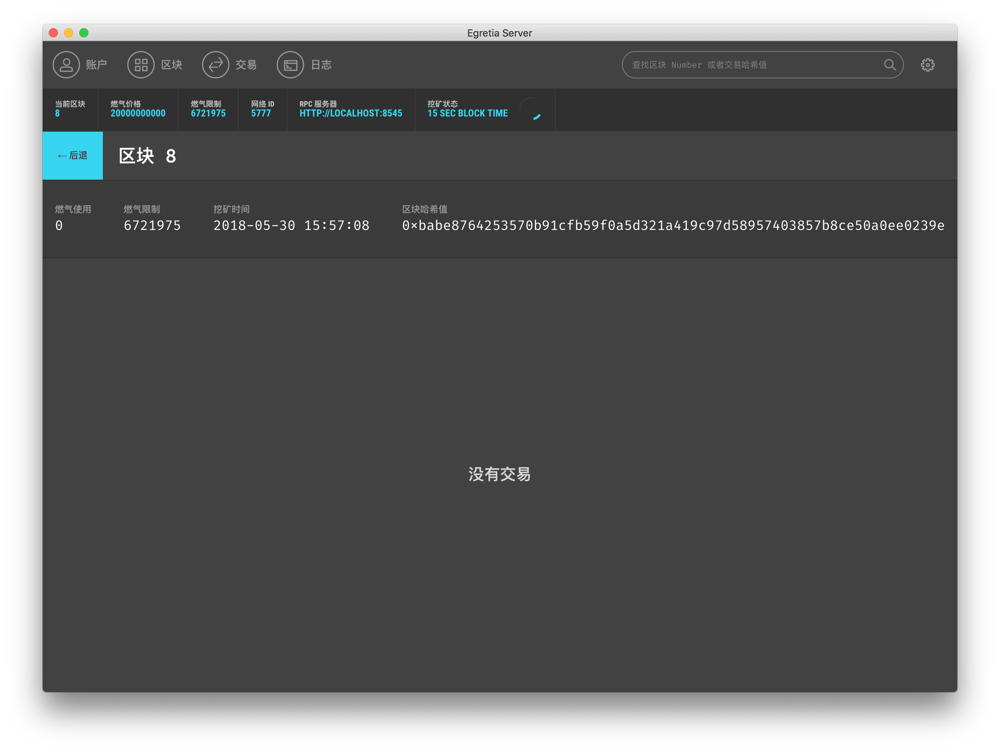
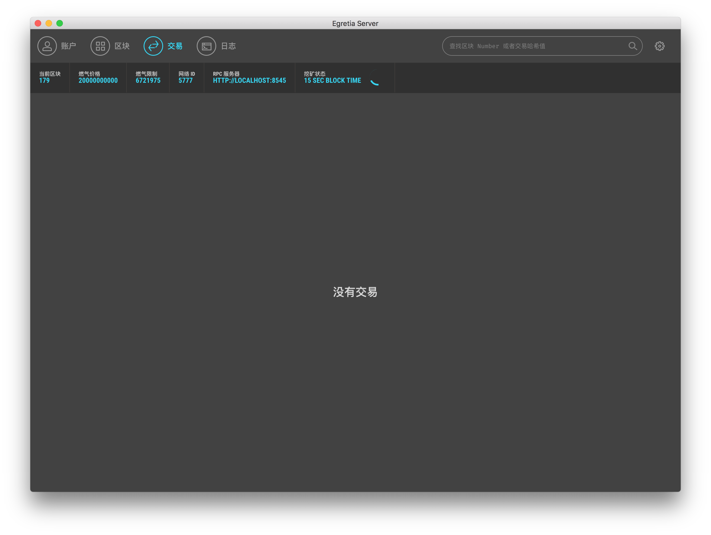

#  Block、 Transaction、 Log

The logic of the other three pages is relatively simple, mainly to facilitate check data in the Dapp development process.

## Block

The first is the block. With the increasing number of transactions in Ethereum, the number of blocks is constantly increasing. When developers need to view the detailed information in the block, the developer only needs to click on the corresponding block data. For example, **block 8**.

Because between **block 8** no any space no transaction information but there will including some basic information such as how much gas had been uesd，how much limit of gas，time of make a new block,(Mining time) when it is convenient and visual method to check.

## Transaction

The transaction is actually generated when a transfer transaction occurs between two accounts, which can be viewed on the trading page.

## Log

After Egretia Server start, log will record important log information never stop. The log function will save large time during development Dapp meet mistake need debug.
