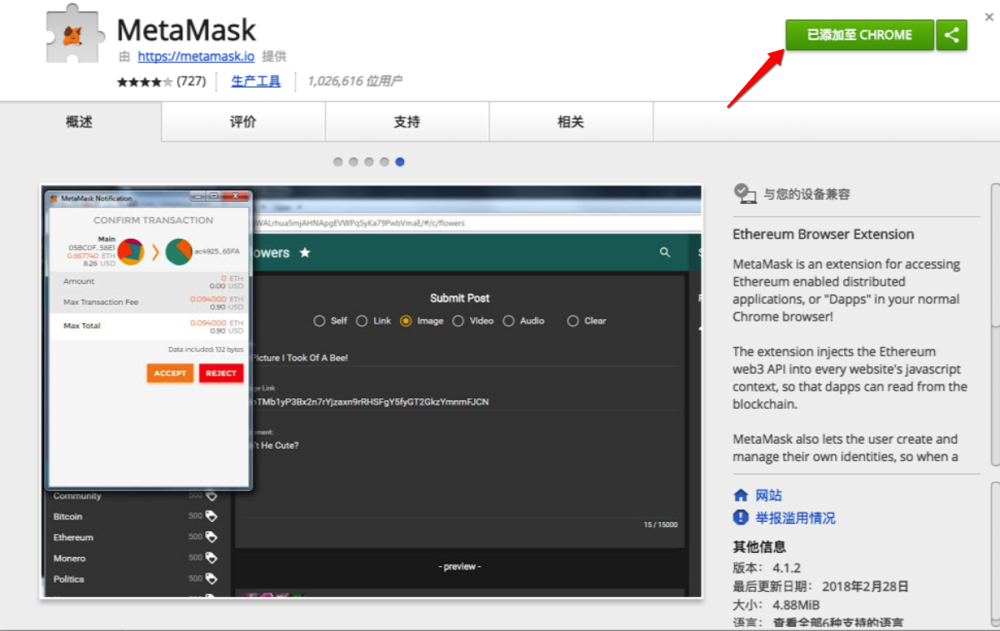
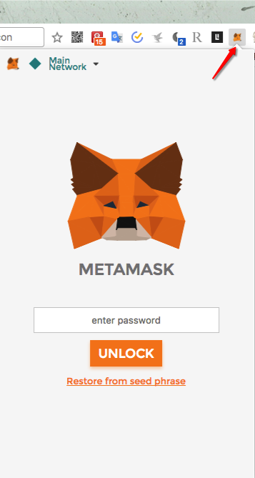
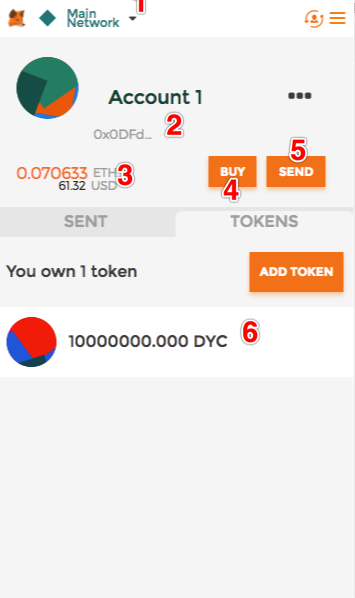
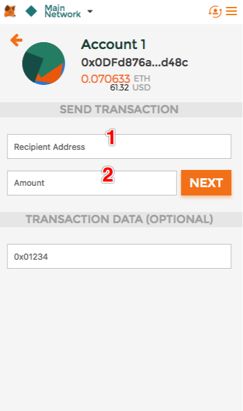

# Metamask Usage

MetaMask is a Chrome Ethereum wallet plug-in, dawnload form Chrome store and the installation.

## MetaMask Installation

First is install MetaMask，[Chrome install address](https://chrome.google.com/webstore/detail/metamask/nkbihfbeogaeaoehlefnkodbefgpgknn?utm_source=chrome-ntp-icon)
You will see the following picture. Click "Add to CHROME" as shown by the arrow.

And then you can see Chrome installation finish MetaMask

According notice click「Accept」，input your wallet password，after input click「CREATE」and record the 12 Mnemonic.

## MetaMask Usage

MetaMask main function

* You can choose MetaMask blockchain network, the default "MainNetwork" is the official network, the next article practice ICO needs to use the test network
* Ethereum address
* Ethereum balance
* You can purchase ETH, but we generally do not use this, you can use the domestic mainstream exchanges, you can ETH to "2" address
* Transfer ETH to other people, but generally use an APP like MyToken

If you use MetaMask transfer ETH to other address，click 「Send」，it will be appear that interface.Input address and number of token，click「NEXT」。

Click「SUBMIT」