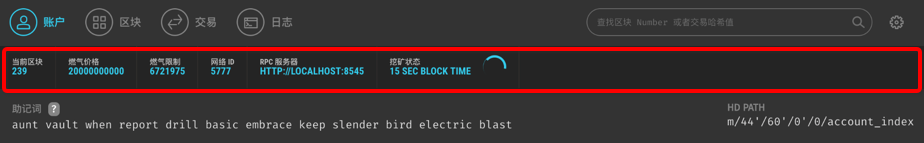

# Overview

The most important thing about Egretia server is the top overview ，it including some important information：current block、Gas Price、Gas Limit、RPC server、mining status.

## Current block

According to the picture，Current block is 239，so the current block is the current total block number of the blockchain. Knowing the current block number can conveniently check the block location of the transaction.

## Gas Price、Gas Limit

During we ues Ethereum transfer amount，so much wallet will jump some choose such as Gas Price、Gas Limit or Fee.

That picture need input Fee.

Select the advanced option as shown in that picture ：Gas Price、Gas Limit.

### Gas Price

The unit price of the gas that the transaction sponsor is willing to pay for this smart contract. The price will fluctuate according to the market supply and demand relationship, not a fixed value.

### Gas Limit

The maximum amount of gas consumed to run a contract. This value is a precautionary program. When an infinite loop code occurs, if the consumed gas reaches the gas limit, the program will be forced to terminate and the dead loop will be terminated.

### Gas Used By Txn

The amount of gas actually consumed by a transaction is a quantitative measure of a fixed function of an already-issued smart contract. The gas that each smart contract actually consumes is different because of differences in code logic.

### Tx Fee

Transaction fee/fee, paid by ETH.

    Total amount = cost Gas unit * unit Gas price

**Attention**

* Gas Limit controls the maximum amount of gas that the miner can consume. If your transfer limits Gas Limit is less than the actual Gas, then your contract running will fail and the cost will be charged.
* If your Gas Limit is much than the Gas you actually need, calculate the cost using the gas you need and the extra Gas will be return to you.

### RPC Server

Ethereum implements remote invocation of Ethereum-related interfaces through RPC services, and as picture show, the current RPC server address is:

    HTTP://127.0.0.1:8545

According to address, you can use Egretia Web Wallet connection debugging, of course, you can also use a third-party wallet such as Metamask connection debugging. For details, please refer to **Metamask joint debugging**.

### Mining status
Mining status is a unique feature of Egretia Server, not Ethereum. The effect of this function is to simulate the real environment of mining in Ethereum. It has two states, automatic mining and mining in accordance with time intervals, automatic mining is completed in an instant, mining according to time intervals, try to imitate the online running environment, to facilitate debugging Dapp.