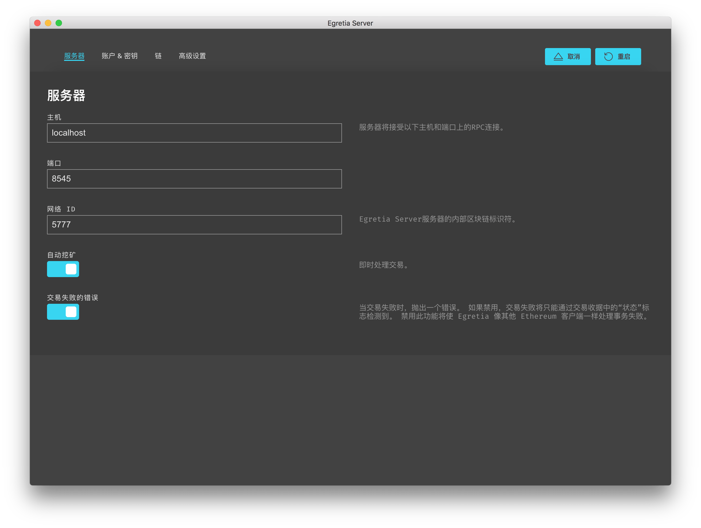
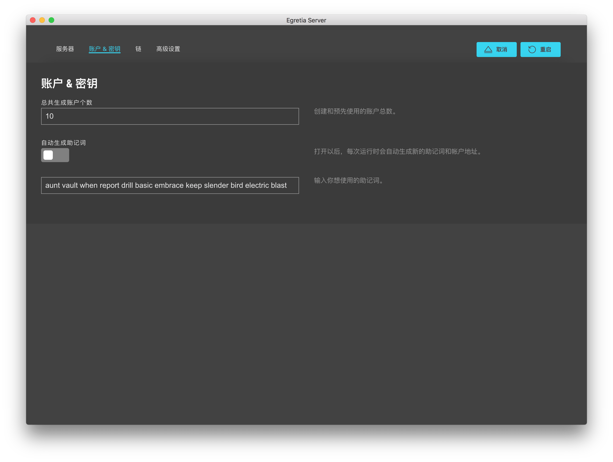
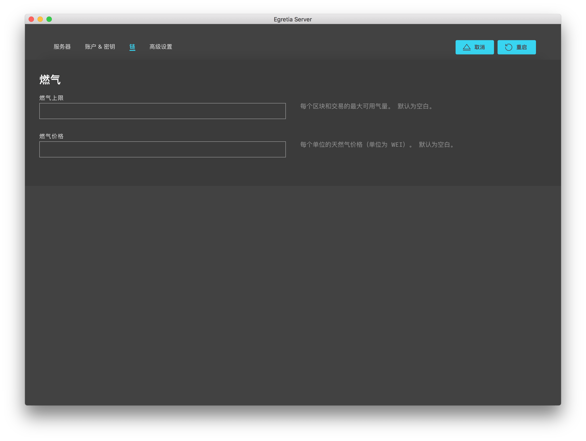
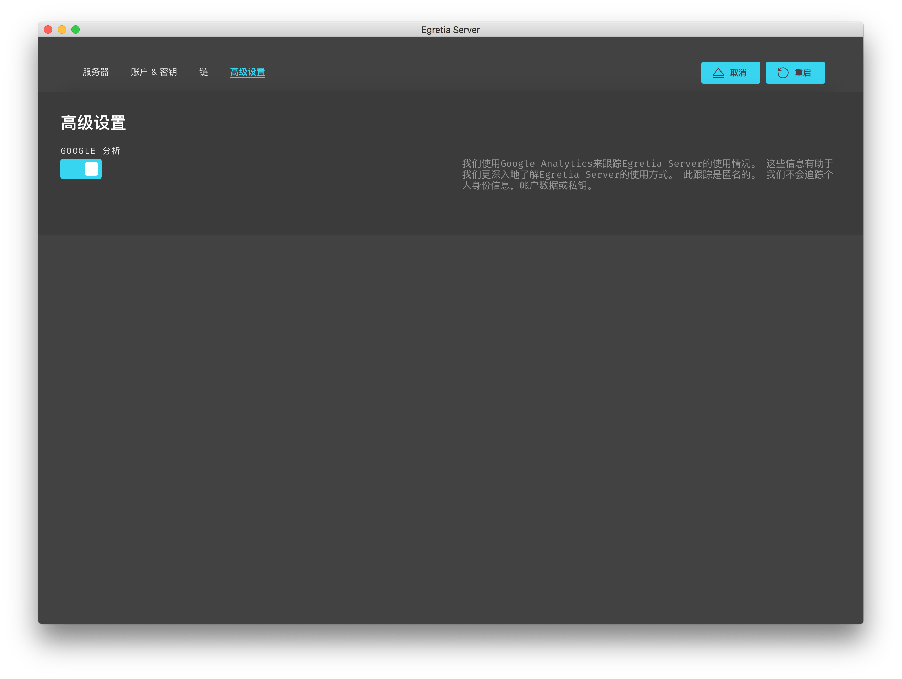

# Egretia Server setting

You can modify the configuration of the local node server through the **Settings** page, accessed through the gear icon in the upper right corner.

After making the changes, you must click **Restart** on the application for the changes to take effect.

## Server

 The page shows detailed information about the network connection, including the main engine name, port, network ID, and whether or not it was automatically mined.

### Main engine

Main engine is just like localhost, which is the address of Dapp connecting Egretia Server.

### Port

Sometimes the port will be in conflict, so you can modify the port here.

### Network ID

Egretia Server server's internal identifier, do not need to be modified generally.

### Automatically mine

Mining status is a unique function of Egretia Server, not Ethereum function. The effect of this function is to simulate the real environment of mining in Ethereum. It has two status, automatic mining and mining in accordance with time intervals, automatic mining is completed in an instant, mining according to time intervals, try to imitate the online running environment, to facilitate debugging Dapp.

## Account & Private password

Here is the account status when setting Egretia Server initialization. For example, the default is to generate 10 addresses. The mnemonic is：

    forum cram fever master forest usual average congress spend hockey crime unlock

However, if you want to generate 20 addresses during initialization, the mnemonics need to be modified every time you regenerate them. Of course, you need to click the upper right corner to save and restart the ** button.

## Chain

* **Gas Limit**：The maximum amount of gas available for each block and transaction. The default is blank.
* **Gas Price**：Natural gas price per unit (unit is WEI). The default is blank.

If you do not fill in it, it will automatically generate one.The general situation of the local test is not modified.

## High level setting

The first time you start Egretia Server, you will be asked if you want to allow Google Analytics tracking. Although optional, turning this feature on will help the development team better understand how Egretia Server is used. This tracking is completely anonymous and does not collect any account data or private keys.

This function ensures that you can turn off statistics at any time.

