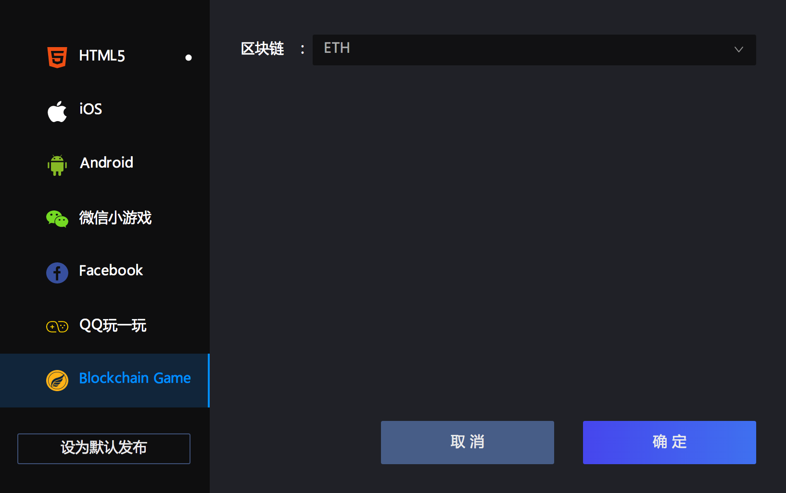

# Hello World

## Launcher Create game

The default developer has installed the Egretlauncher tool, open Egretlauncher, click on Project > Create project, check Egretia SDK module, after creating the project, Egretia SDK library will be automatically added to the game project, as shown in the figure:
  

## Wing Compile Dapp code
  
* The command space in the Egret SDK is `Web3`, then you need to create a `web3` instance and set up a provider. To ensure that you do not overwrite an existing provider, such as when using MetaMask or EgretiaWallet, you need to first check for the existence of a `web3` instance.

> After get instance, you can use 'web3' related [API](https://)

* The use of Egretia SDK API, here demonstrates the transfer function, as shown in the picture:

## SmartIDE compile smart contract

Online smart contract editor[Address](http://smartide.egretia.io/), the `add()` method is used to return the sum of two input data and count the number of calls to the `add()` method. Note that this count is in the blockchain and calls to it require the use of `transaction`. `getCount()` returns the number of calls to the `add()` function. Because this functions never change blockchain any statue, you can use call debug it.

  
## Use Egretia Server debug Dapp
  
During the development process,if we directly use blockchain's test,the network speed will very slow and meet some trouble. We can ues `Egretia Server` for local debugging. (Download address)[]According to note install it. RPC Server address is wallet connect address, after connect click copy mnemonic, import wallets via mnemonics.

## Web Wallet debug Dapp
  
Web Wallet is a web-side wallet provided to developers by Egretia team.The different between blockchain's game development and troditional game development is  that blockchain games need to interact with the blockchain often, so they often deal with wallets. Although third-party wallets such as Metamask are available on the market, it is not very convenient for Egretia workflows, so the Egretia team developed the local debug wallet Web Wallet.

Just add the following sentence in index.html to use:Just add the following sentence in index.html to use:

      

As shown picture below：

After lead into successful running interface:

  

## Publish Dapp
  
click publish settings.

Pop-up publishing options, select Blockchin Game, click publish, will be released to `bin-release` directory.

> do not need a wallet, you need to comment out the wallet introduction code in index.html.