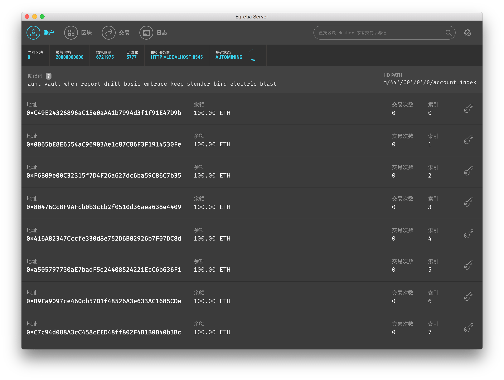
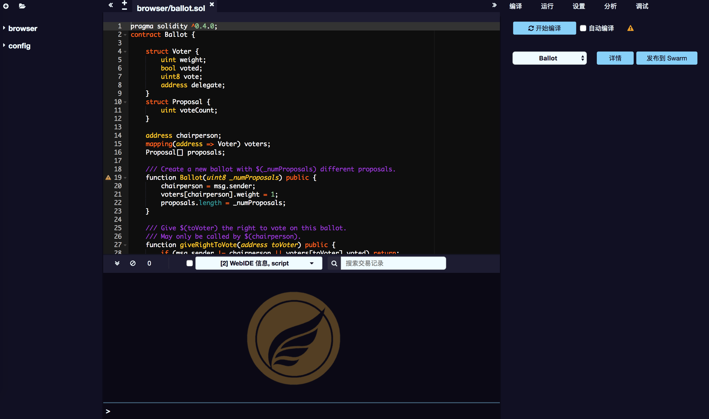

# Development environment configuration

## Install Launcher 

Launcher is a unified portal for Egret tools and services. Launcher not only can easily download and manage Egret Engine, but also can download and manage Egret workflow related tools. In addition, HTML5 projects are created, managed, and released through the Launcher, so developers The first thing you need to install is the Launcher.

Download [Egret Launcher](http://www.egret.com/products/engine.html),（Reference: [Installation and Deployment](http://developer.egret.com/cn/github/egret-docs/Engine2D/projectConfig/installation/index.html)）。

### Install development tools

Open Egret Launcher, the login screen will be displayed, as shown below.

After successful login, the main interface of Egret Launcher will be displayed.

## Install Egret Engine

Egret Engine is an open source, free, cross-platform HTML5 engine that solves HTML5 performance issues and fragmentation issues, flexibly meets developers' needs for developing 2D or 3D games, and has strong cross-platform capabilities.

Open the Launcher Engine page.

Click the download button to the right of the engine version to install the latest version of the engine, and you can create a project in the project interface.

## Install Egret Wing

Egret Wing is an integrated development environment with fast start-up, fast response, and a rich user-friendly integrated development environment. It supports smart spelling and breakpoint debugging in mainstream languages and frameworks. Egret Wing lets developers experience faster workflows.

Open Launcher Tools page.

Click download Egret Wing and install it. If there is a new version of Launcher, it will be installed by push.

## Install Egretia Server

Egretia Server is Ethereum develop local node server,you can ues it deploy smart contract, develop a applications run and test it.

Open Launcher Tools page.

Click download Egretia Server and install it. If there is a new version of Launcher, it will be installed by push.

Open Egretia Server and then the content will be shown above

## SmartIDE Usage

SmartIDE is a powerful smart contract editing, debugging, publishing tool that helps you write Solidity contracts directly from the browser.

SmartIDE running in the cloud, the follow-up will open up with the SmartStore.

Online address：http://smartide.egretia.io/
