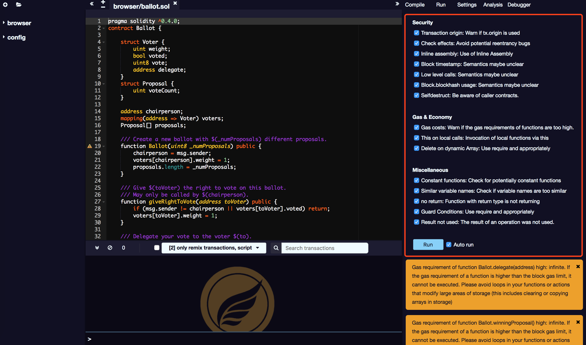

# Analysis

The analysis function provides information about the last compilate information. By default, each compilation running a new analysis. Of course you can also turn it off.

The analysis tab provides detailed information about the contract code. It can help you avoid code errors and implement best practices.

The following is the list of analyser:

## Safe

* Transaction origin: If tx.origin is used, it will warn;
* Check effects: Avoid potential reentrant bugs;
* Inline assembly: Using implanted assembly；
* Block timestamp: Semantics maybe not clear；
* Low level calls: semantics maybe not clear；
* Block.blockhash usage: Self-destructive call；

## Gas and Economics

* Gas costs: GAS consumption of function is too high will alarm。
* This on local calls: After checking the local function will be awakened；

## Other

* Constant functions: Check potential regular-function
* Similar variable names: Check the variable name, if the variable name is too similar

## Warning

At the bottom is the optimization warning for this compilation, which is used by the programmer to optimize the code.