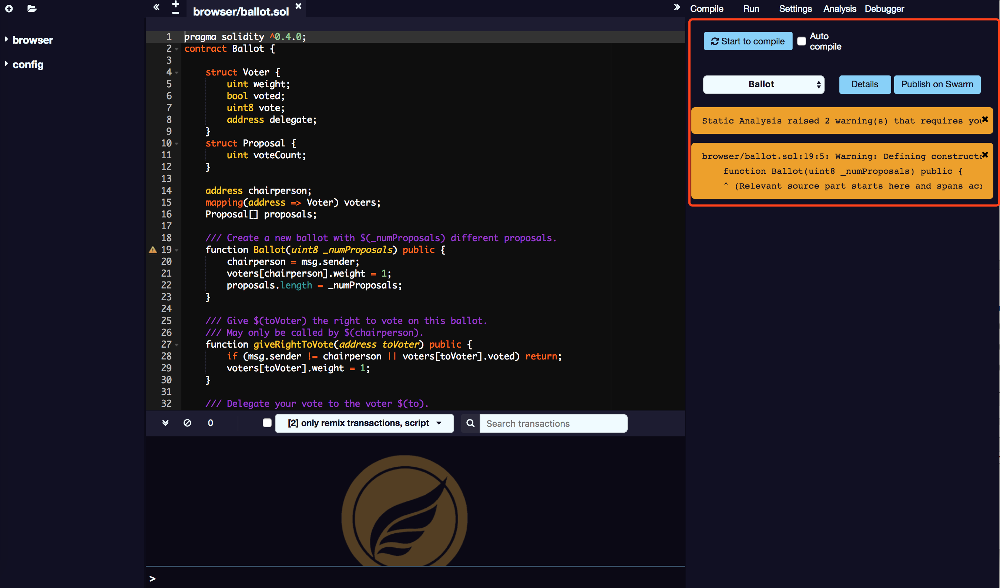

# Compile

By default, SmartIDE triggers compilation every time you change the current file or select another file. If your contract has many dependencies that take a long time to compile, you can disable automatic compilation.

## Automatically update the list of contracts

After each compilation, the list updates all lastest compiled contracts.

## Details

The Details Mode dialog box shows detailed information about the currently selected contract.

## Publish to Swarm

In this tab, you can also publish your contract to Swarm. After the contract is published, you can use the bzz URL located in the details mode dialog to find its metadata information.

## abi 

Published data significantly includes the abi and solidity source code.

## Error & Warning

Compilation errors and warnings are displayed under the contract section. In each compilation, the static analysis tab generates a report. Even if the compiler does not report an error, this report is very valuable.