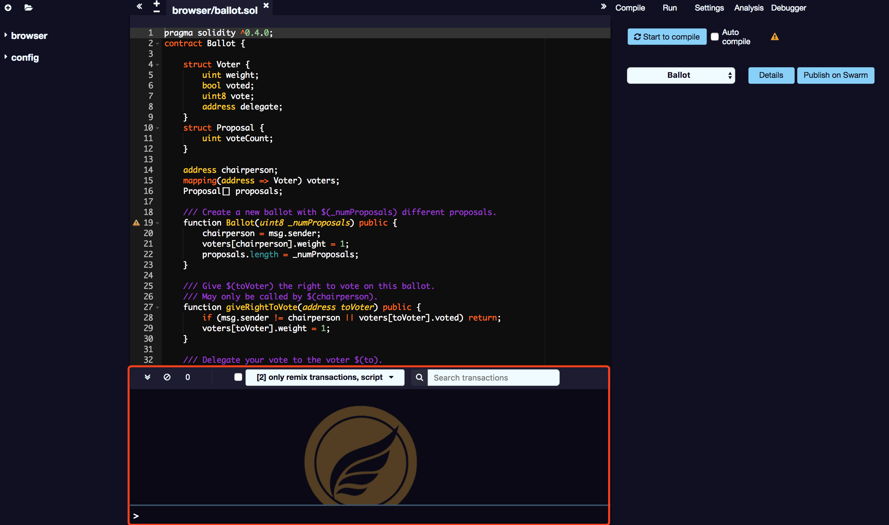

# Console output

Function provided by the console:

##Script execution

It integrates JavaScript interpreter and Web3 object. It supports executing JavaScript scripts that interact with the current context.

## SmartIDE event

It displays important operations that occur when interacting with SmartIDE (that is, sending new transactions).

## Other events

It displays the transaction events in the current context. You can choose to display all events, or only display SmartIDE related events.

## Elimination of events

It allows the search for data and clears the log from the terminal.
