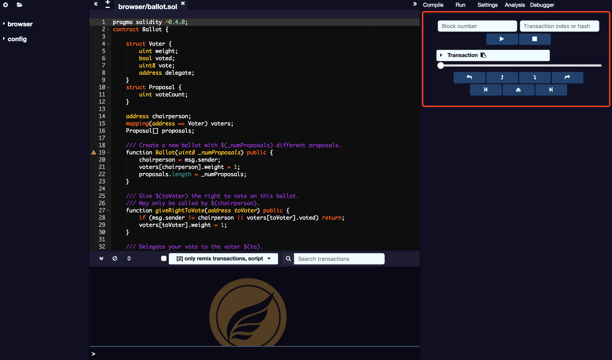
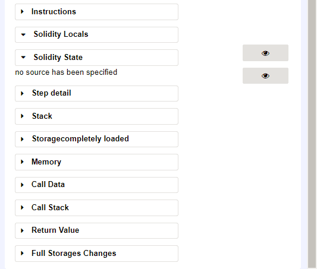
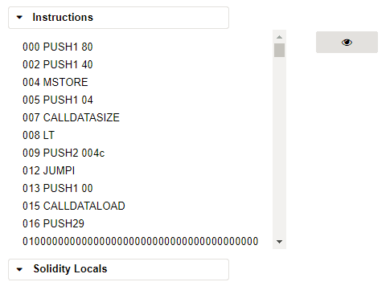
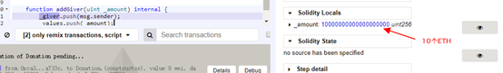
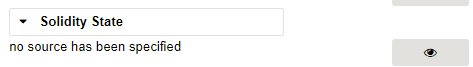
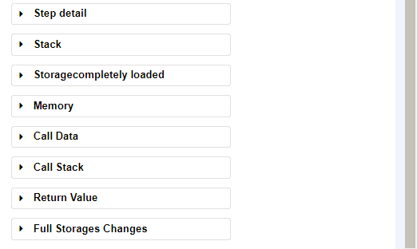
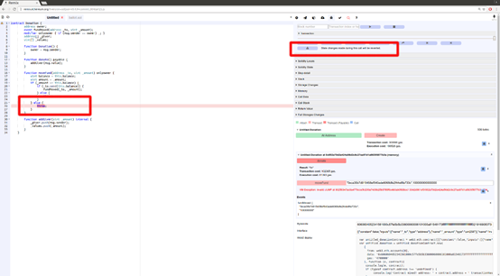
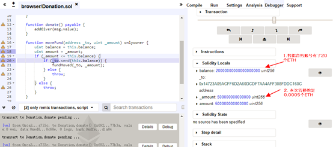
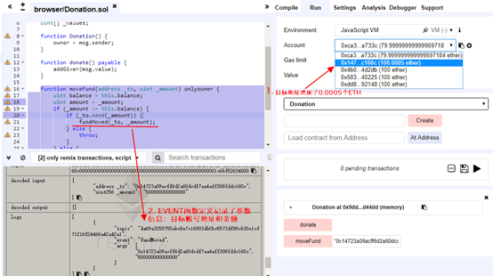

# Debug

This module allows you to debug the transaction. It can be used to deploy transactions created from SmartIDE. (only when the current environment provides the necessary functions, debugging is effective).

The debugger allows you to see the details of the execution of the transaction contract. It uses the editor on the left to show the location of the source when executing.

The transaction control face-plate shows the basic information of the current trading contract. The navigation bar includes 7 buttons for step-by-step trading.

**Debugger Button**

Button names from left to right :
* step over back
* step back
* step into
* step over forward
* jump to the previous breakpoint
* jump out
* jump to the next breakpoint

Here are 11 face-plates for displaying the details of the execution.

## Instructions face-plate

Instructions face-plate displaying the assembly language of the currently highlighted operating contract.

**Attention：** When the panel is hidden, the running granularity of the slider is a course, and even if it is constructed in a multi-EVM environment, it will only stop at the syntax boundary; when the panel is displayed, it may gradually enter the inside of the construction function, even if the corresponding Statements.

## Solidity Locals face-plate

Solidity Locals face-plate displaying current context local variable values.

## Solidity State face-plate

Solidity Stateface-plate displaying current execution contract state variables.

## Low level face-plate

The following face-plate shows the low-level information of this execution：

* Stack 
* Storages Changes 
* Memory 
* Call Data 
* Call Stack 
* Return Value 
* Full Storages Changes Only show all changed contract change stores at the end of execution

## Reverted Transaction

A trading contract can be rolled back, for example because the GAS is overrun, the program throws a throw statement or a low-level exception. In this scenario, it is very important to identify the code location of the anomaly and the location exception. SmartIDE warns when an exception is thrown. The warning button will jump to the last execution primitive before the exception occurs.

It needs to be explained that the execution of intelligent contract transactions is event level, that is, it can not change the value of variables like C++, and can only be executed once. The debugger records the execution primitive record, so it can move forward and roll back. For rollback, just like movie rollback, it's very cool.

## Breakpoints Breakpoints and single-step debugging

The navigation bar's 5, 7 buttons are used to roll back to the previous breakpoint and execute to the next breakpoint.

Click on the number of rows in the left edit box to add and remove breakpoints.

As an example, double-click on lines 18 and 20 to set two breakpoints. Enter parameters in the moveFund input box of the Run panel to transfer 0.0005 ETHs to the second account. Click "MoveFund" to execute the trading function.

"0x14723a09acff6d2a60dcdf7aa4aff308fddc160c",500000000000000

After transaction execute successful, click the terminal output divice Debug button,click the debug face-plate “Jump to the next breakpoint” program will run to the first breakpoint.

Click the “Jump to the next breakpoint” button again, program will run to 20 lines second breakpoint.

Click "Jump out" function to jump out of the function, after the completion of the operation can see the second account balance has changed, an increase of 0.0005 ETH.

Click to expand Detail, you can see the parameter information of the EVENT event record.
