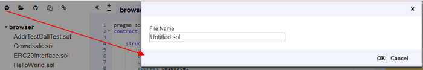

# Document Manager

By default, the file browser lists all files stored in the browser. You can see them in your browser folder. You can rename, delete or add new files to File Explorer at any time.

Please note that clearing your browser storage will permanently delete any reliable files you write.

We will start with the icon in the upper left corner - from left to right:

## Create new file

Untitled.sol Create a new file in Remix.

## Adding a Local File

Allows you to select a file from the local file system and import it into the Remix browser store.
