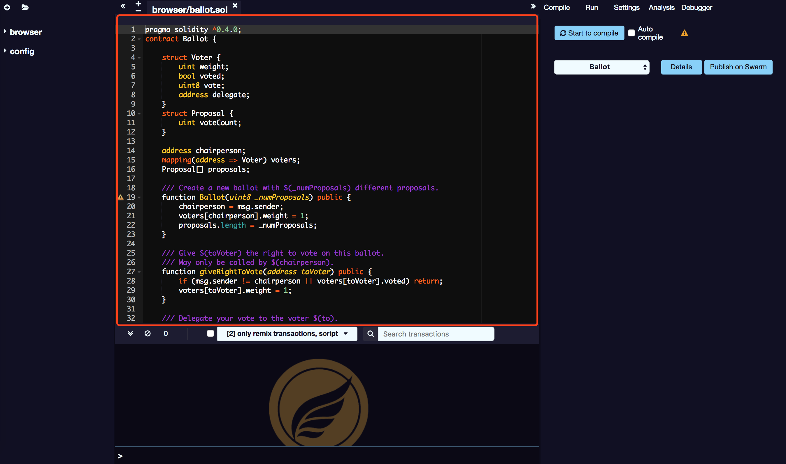

# Code editor

SmartIDE Editor recompiles the code every time you change the current file or select another file. It also provides grammar highlighting of keywords.

Here are some important function：

## Warning、Error

Edit warnings and errors are displayed in the right area.

## Automatically save files

SmartIDE automatically saves the current file (after 5 seconds of the last change).

## Font size

+/- In the upper left corner, you can increase/decrease the font size of the editor.