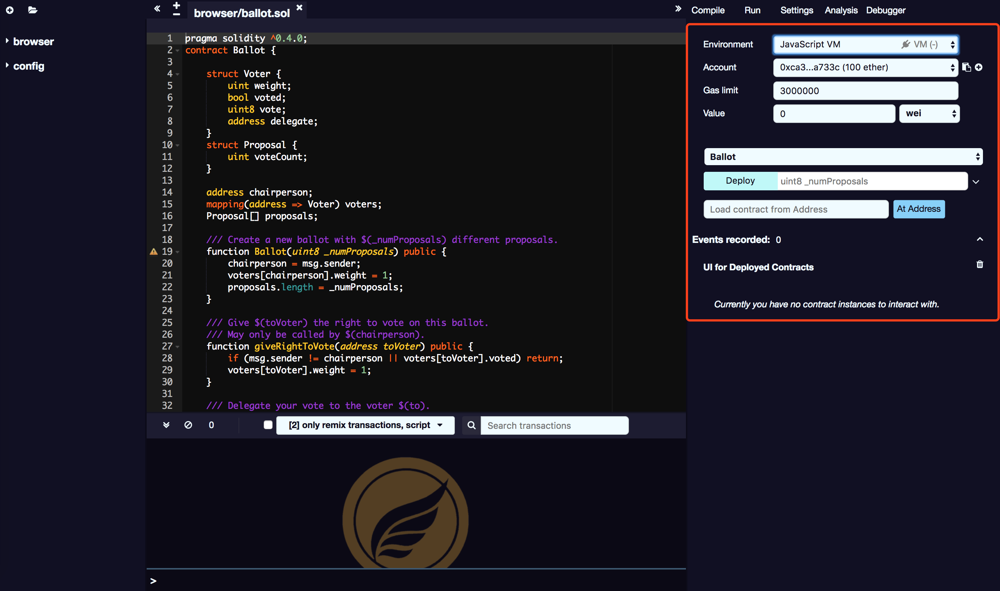

# Run & deploy

The running option card is an important part of SmartIDE. It allows you to deploy intelligent contracts to block chains.

## Environment

* **JavaScript VM：**All transactions will be executed in the browser's sandbox blockchain. This means that this is just some temporary data, page reload will restart a new blockchain, and temporary data will be cleared.
* **Injected Provider：** SmartIDE will connect to a wallet that provides Web3 injection, such as Metamask.
* **Web3 Provider：** SmartIDE will connect to the remote node. You need to provide the selected provider with the URL address. This will connect the Egretia Server's RPC address.

## Account

The list of accounts (and related balances) associated with the current environment.

## Gas Limit

The maximum amount of gas that can be set for all transactions created in SmartIDE. If it exceeds it will force the code to stop running.

## Gas 

Gas price of the next created transaction (this value is always reset to 0 after each transaction is executed).

## Deploy

This section contains a list of compiled contracts and two operations list：

* **At Address：** Assume that the given address is an instance of the selected contract. You can then interact with the deployed contract. Because there is no check at this time, be careful when using this function and make sure that you trust the contract for that address.
* **Create：** Send the transaction to deploy the selected contract.When the transaction is package into blockchain, the newly created will be added (this may take a few seconds). Note that if the constructor has parameters, you need to specify them.
* **Pending instances：** It takes a few seconds to verify the transaction. During this time, the GUI will display it in suspend mode. When the transaction is packaged into blocks, the number of pending transactions is updated and the transaction is added to the log.