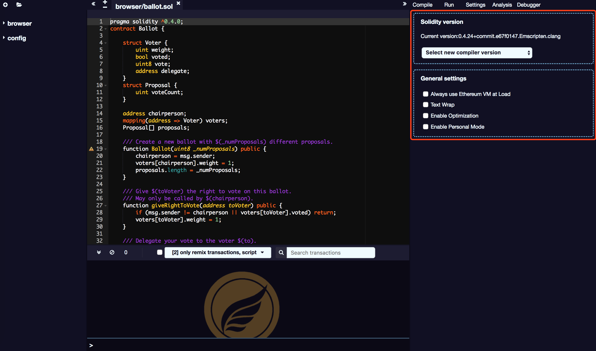

# Setting

The setting shows the current compiler version and allows changes to other versions.

## Text wrap

Controls whether the text in the editor should be wrapped.

## Enable optimization

Defines whether the compiler should enable optimization during compilation. Enabling this option saves executing gas. It is useful to enable optimisation of contracts that are ready to be deployed in production, but may cause some inconsistencies when commissioning such contracts.