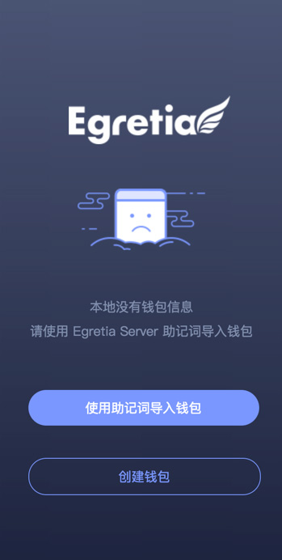
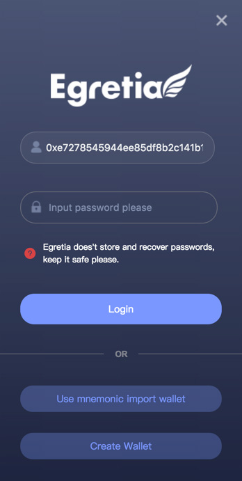
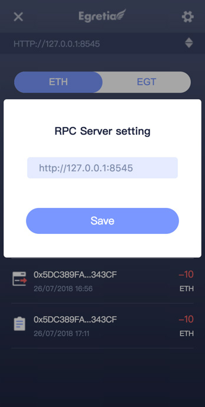
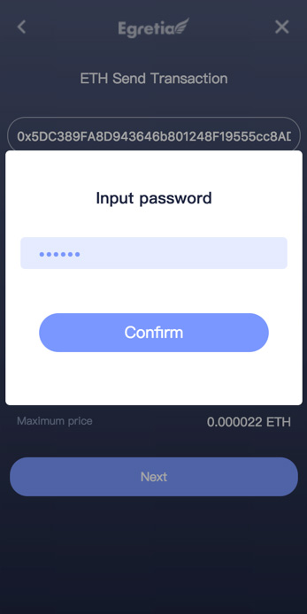
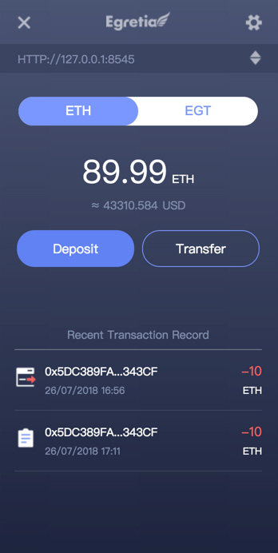

# EgretiaWallet Operation Manual

EgretiaWallet is a web-side wallet provided to developers by Egretia team.The different between blockchain's game development and troditional game development is  that blockchain games need to interact with the blockchain often, so they often deal with wallets. Although third-party wallets such as Metamask are available on the market, it is not very convenient for Egretia workflows, so the Egretia team developed the local debug wallet EgretiaWallet.

During the development process of blockchain games, EgretiaWallet is embedded into the game so that it can be easily used when debugging the game.

## Wallet login

EgretiaWallet login is currently divided into two steps. The first step is to use Egretia Server mnemonics. The second step is to use password to log in.

Open Egretia Server，get mnemonics.

And the use Wing click debug game，transfer the EgretiaWallet page**Use mnemonics to import wallets**

And then input mnemonics and password, which is the password that will later be used to login to EgretiaWallet.

After first login, you only need to use the password login your wallet. Of course, the developer can use the mnemonic to re-import the wallet at any time.

## RPC Connect

The address of the Egretia Server RPC server can be set in the **settings** of Egretia Server. EgretiaWallet needs to set this address to work normally. 

Through Egretia Server get RPC address.

Open EgretiaWallet RPC setting page，paste and save，you can get Egretia Server data。

## Transfer

After the wallet is login successfully, you can check the current balance and the corresponding US dollar. Of course, the developer can make a transfer. For example, the developer transfers 10ETH from the address `0x939493274924093` to `0x939493274924093`.

First click transfer input 10 and then click sumbit,final input password.

## Payment

that all is EgretiaWallet basic function,but how to interactive between game and EgretiaWallet?The above describes the basic functions of EgretiaWallet, and how does the game interact with EgretiaWallet? Take the AVG as an example.

We purchase 0.5 Huanhundan,that need a ETH,click the button.

A EgretiaWallet confirmation window pops up. Enter the password.

