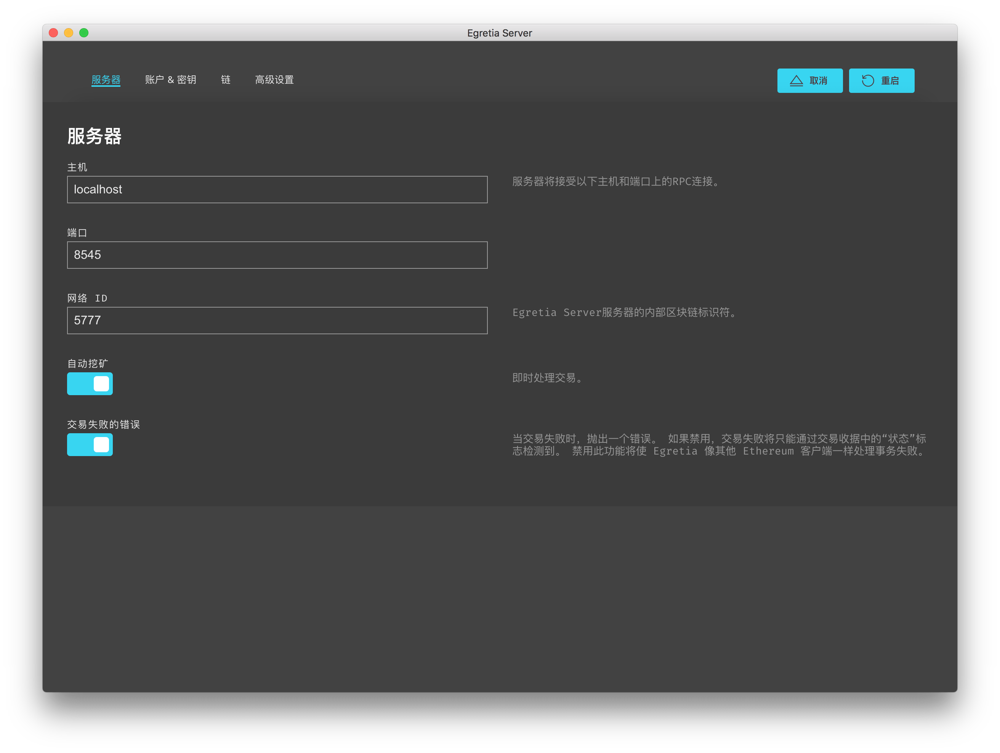
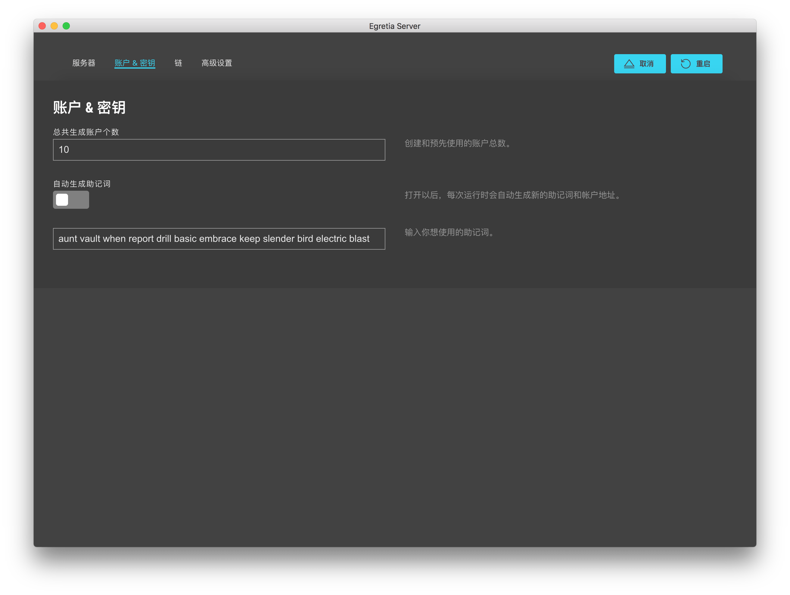
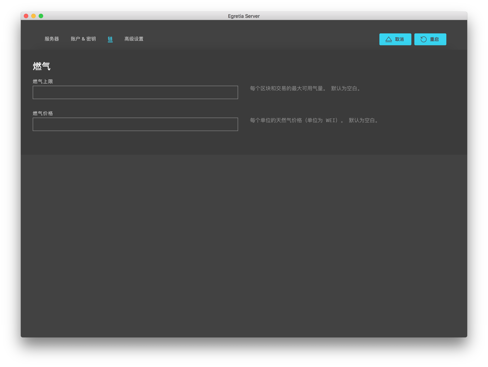
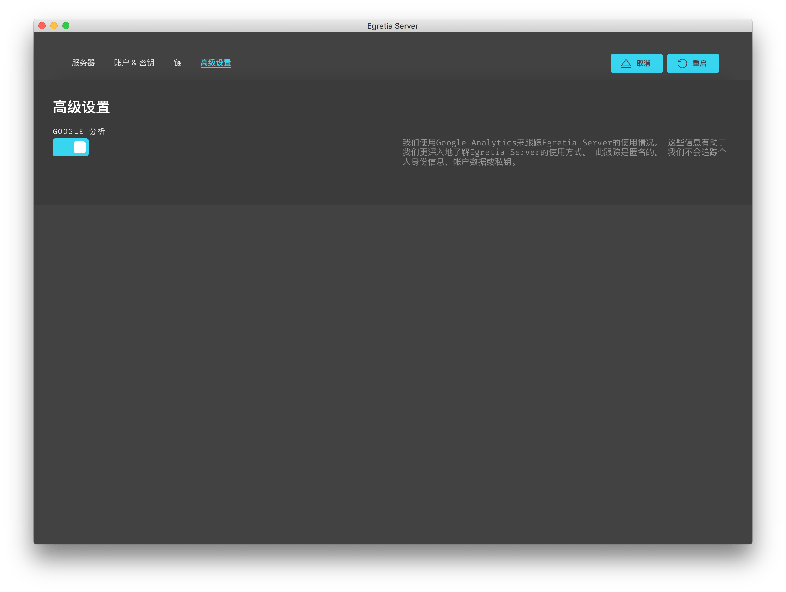

# Egretia Server 设置

您可以通过**设置**页面修改本地节点服务器的配置，可通过右上角的齿轮图标进行访问。

进行更改后，您必须单击应用程序上的**重新启动**才能使更改生效。

## 服务器

页面显示有关网络连接的详细信息，包括主机名，端口，网络ID以及是否自动挖矿。

### 主机

主机其实就是和 localhost 一样，就是 Dapp 连接 Egretia Server 的地址。

### 端口

有时候端口会有冲突情况，可以在这里修改端口。

### 网络 ID

Egretia Server 服务器的内部标识符，一般情况下不用修改。

### 自动挖矿

挖矿状态是 Egretia Server 特有的一个功能，而不是以太坊的功能，这个功能的作用是为了模拟以太坊挖矿的真实环境而产生的。他有两种状态，自动挖矿和按照时间间隔挖矿，自动挖矿瞬间完成，按照时间间隔挖矿，尽量模仿线上运行环境，方便调试 Dapp。

## 账户 & 密钥

这里是设置 Egretia Server 初始化的时候的账户状态，比如默认是生成 10 个地址，助记词是：

    forum cram fever master forest usual average congress spend hockey crime unlock

但是如果您想初始化的时候生成 20 个地址，助记词需要每次重新生成的话就可以修改这里，当然修改完毕后需要点击右上角**保存并重启**按钮。

## 链

* **燃气上限（Gas Limit）**：每个区块和交易的最大可用气量。 默认为空白。
* **燃气价格（Gas Price）**：每个单位的天然气价格（单位为 WEI）。 默认为空白。

如果不填写的话会自动生成一个，本地测试的话一般情况不用修改。

## 高级设置

第一次启动 Egretia Server 时，系统会询问您是否要允许 Google Analytics（分析）跟踪。虽然可选，但开启此功能将有助于开发团队更好地了解 Egretia Server 是​​如何使用的。此跟踪完全匿名，并且不会收集任何帐户数据或私钥。

这个功能能保证您能随时关闭数据统计。

