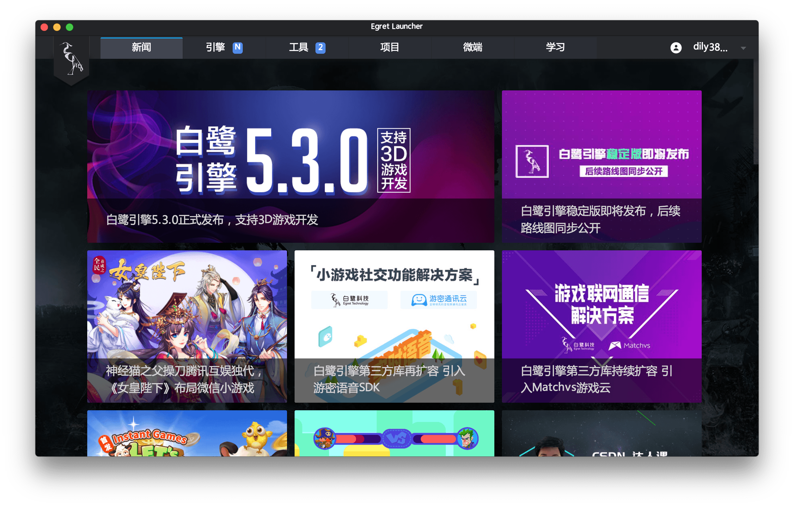
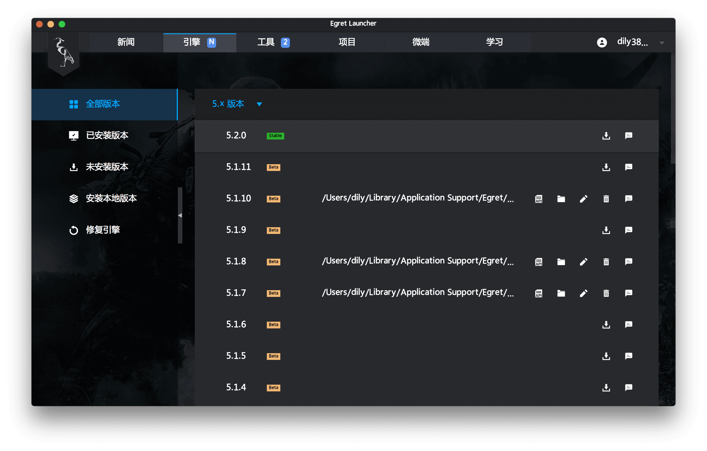

# 开发环境配置

## 安装 Launcher

Launcher 是 Egret 工具及服务的统一入口，Launcher 不仅能够方便的下载管理 Egret Engine，还能下载管理 Egret 工作流相关工具，除此之外 HTML5 项目的创建、管理、发布也通过 Launcher 完成，所以开发者首先需要安装的就是 Launcher。

下载 [Egret Launcher](http://www.egret.com/products/engine.html),（可参考：[安装与部署](http://developer.egret.com/cn/github/egret-docs/Engine2D/projectConfig/installation/index.html)）。

### 安装开发工具

打开 Egret Launcher，会显示登录界面，如下图。

登陆成功后会显示 Egret Launcher 主界面。

## 安装 Egret Engine

Egret Engine 是开源、免费、跨平台的 HTML5 引擎，它解决了 HTML5 性能问题及碎片化问题，灵活地满足开发者开发2D 或 3D 游戏的需求，并有着极强的跨平台运行能力。

打开 Launcher 的引擎页面。

点击引擎版本右侧的下载按钮安装引擎最新版本，即可在项目界面创建项目。

## 安装 Egret Wing

Egret Wing 是一款具备极速启动、快速响应以及丰富的人性 化集成开发环境，并支持主流语言、框架的智能拼写与断点调试。Egret Wing 让开发者体验更快捷的工作流。

打开 Launcher 的工具页面。

点击下载 Egret Wing，下载完成后安装即可，如果有新的版本 Launcher 会进行推送安装。

## 安装 Egretia Server

Egretia Server 是以太坊开发的本地节点服务器，您可以使用它来部署智能合约，开发应用程序并运行测试。

打开 Launcher 的工具页面。

点击下载 Egretia Server，下载完成后安装即可，如果有新的版本 Launcher 会进行推送安装。

Egretia Server 打开后效果如上图所示。

## SmartIDE 使用

SmartIDE 是一款功能强大的智能合约编辑、调试、发布工具，可帮助您直接从浏览器编写 Solidity 合约。

SmartIDE 运行在云端，后续会和 SmartStore 打通。

在线地址：http://smartide.egretia.io/
