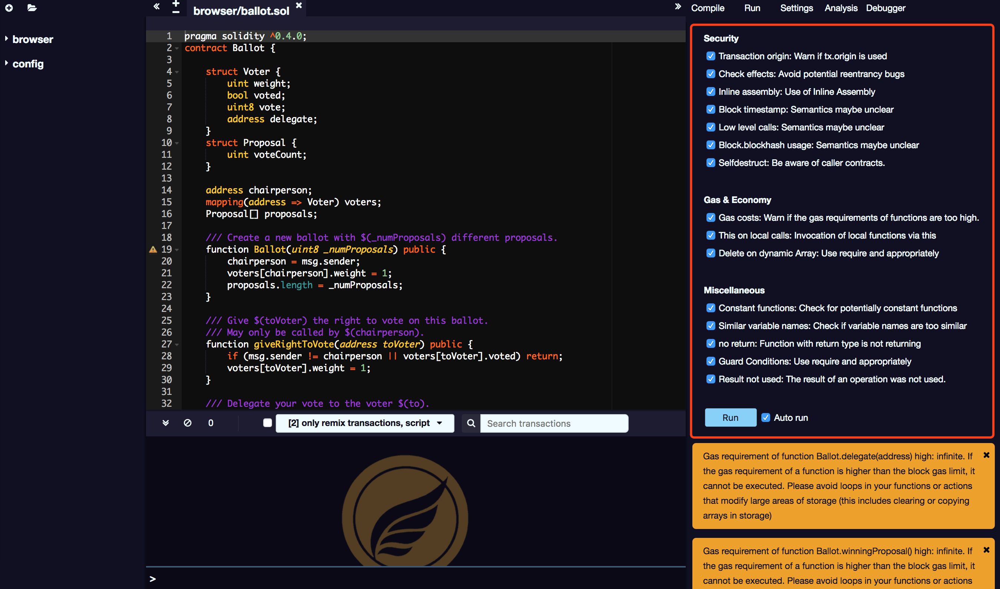

# 分析

分析功能提供有关上次编译的信息。默认情况下，每个编译都会运行一个新的分析。当然你也可以关掉。

分析选项卡提供有关合同代码的详细信息。它可以帮助您避免代码错误并实施最佳实践。

以下是分析仪的列表：

## 安全

* Transaction origin: 如果 tx.origin 被使用则会告警；
* Check effects: 避免潜在的可重入性 BUG；
* Inline assembly: 使用植入汇编方式；
* Block timestamp: 语义可能不清楚；
* Low level calls: 语义可能不清楚；
* Block.blockhash usage: 自毁调用；

## 天然气和经济

* Gas costs: 函数的GAS消耗太高会告警。
* This on local calls: 勾选后本地函数会被唤醒；

## 其它

* Constant functions: 检查潜在的常量函数
* Similar variable names: 检查变量名是否太相似

## 警告

最下方显示的是本次编译的优化警告，供程序员优化代码使用。