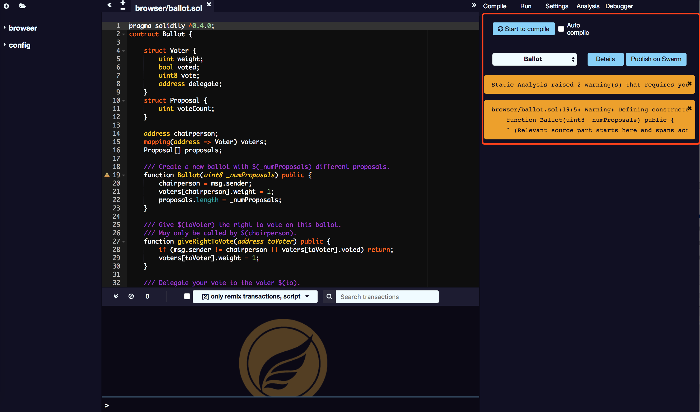

# 编译

默认情况下，每次更改当前文件或选择其他文件时，SmartIDE 都会触发编译。如果合同有很多依赖关系会需要很长时间才能编译，那么可以禁用自动编译。

## 自动更新合约列表

每次编译之后，列表会更新所有新编译的合约。

## 详情

详细信息模式对话框显示有关当前选定合同的详细信息。

## 发布到 Swarm

在这个标签中，您也可以将您的合同发布到 Swarm。合同发布后，您可以使用位于详细信息模式对话框中的 bzz URL 来查找其元数据信息。

## abi 

已发布的数据显着包含了 abi 和 solidity 源代码。

## 报错 & 警告

编译错误和警告显示在合同部分下方。在每个编译中，静态分析选项卡都会生成一个报告。即使编译器没有报错，这个报告也是非常有价值的。