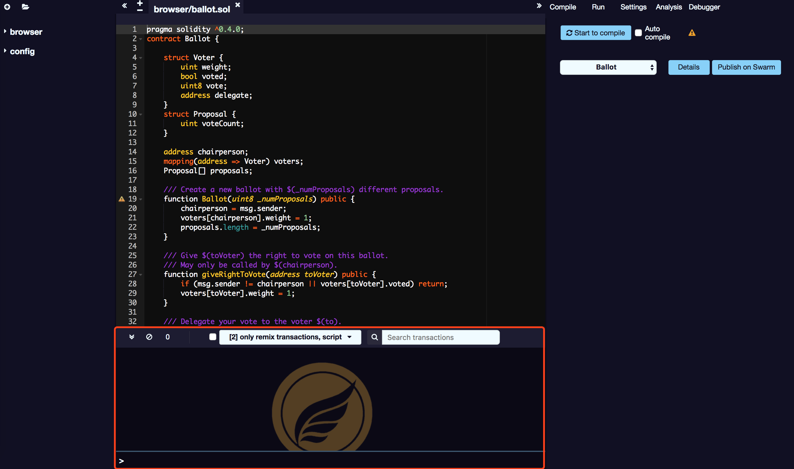

# 控制台输出

在控制台中提供的功能：

## 脚本执行

它集成了 JavaScript 解释器和 web3 对象。它支持执行与当前上下文交互的 JavaScript 脚本。

## SmartIDE 事件

它显示与 SmartIDE 交互时发生的重要操作（即发送新交易）

## 其他事件

它显示在当前上下文中的交易事件。您可以选择显示所有事件，或只显示与 SmartIDE 相关事件。

## 事件清除

它允许搜索数据并从终端清除日志。